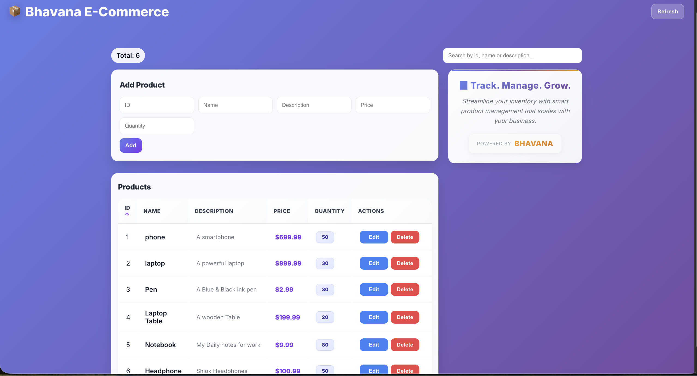

# FastAPI Product Management System

A modern, high-performance REST API built for managing a product catalog. This project demonstrates the implementation of a full-stack backend architecture using Python.

## 📌 Overview
Designed and developed a backend system for managing product inventory using FastAPI. 
The project demonstrates RESTful API design, database integration, and scalable backend architecture.

## 🚀 Features
* **Asynchronous API:** Built with FastAPI for high performance.
* **Database Management:** Uses PostgreSQL with SQLAlchemy ORM.
* **Data Validation:** Strict type checking and validation using Pydantic.
* **CRUD Operations:** Full support for Creating, Reading, Updating, and Deleting products.

## 🛠️ Tech Stack
* **Backend:** Python 3.12, FastAPI, Uvicorn
* **Database:** PostgreSQL
* **ORM:** SQLAlchemy
* **Environment:** Virtual Environments (venv), Git

## 📋 Installation & Setup
1. **Clone the repo:**
   `git clone https://github.com/bhavanadixit1991/fastapi-product-project.git`
2. **Create Virtual Environment:**
   `python3 -m venv myenv`
   `source myenv/bin/activate`
3. **Install dependencies:**
   `pip install fastapi uvicorn sqlalchemy psycopg2-binary`
4. **Run the server:**
   `uvicorn main:app --reload`

## 🔗 Learning Credits
This project was developed as part of the **Telusko FastAPI Tutorial**, covering modern REST API development and database integration.

## 📸 Preview

